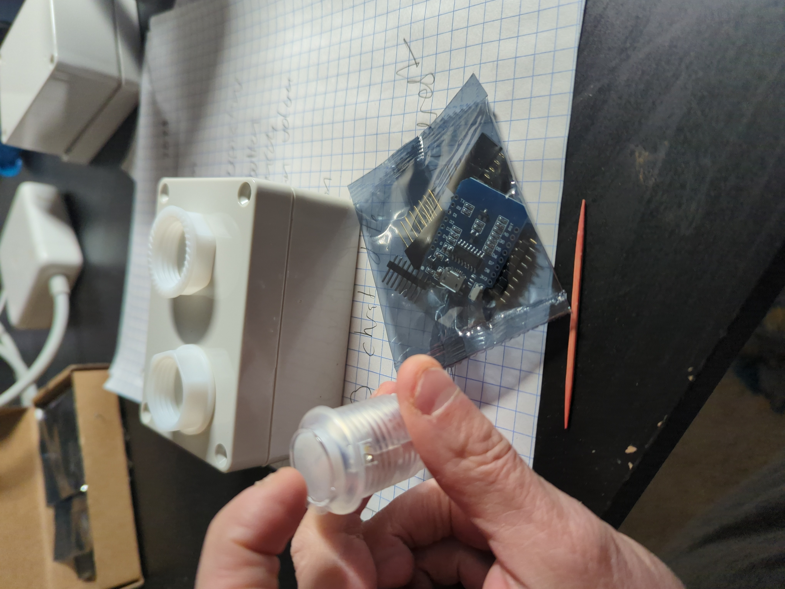
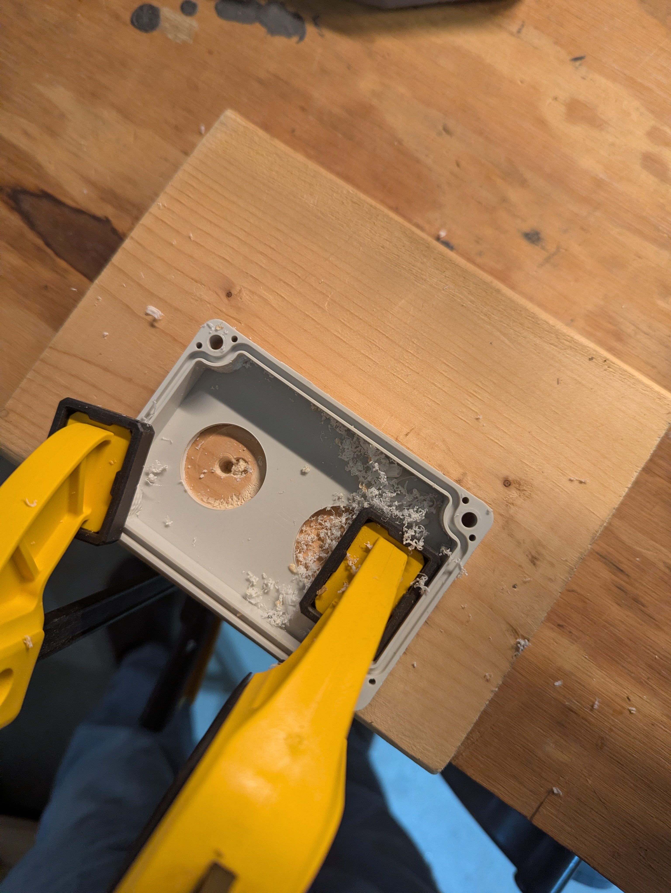
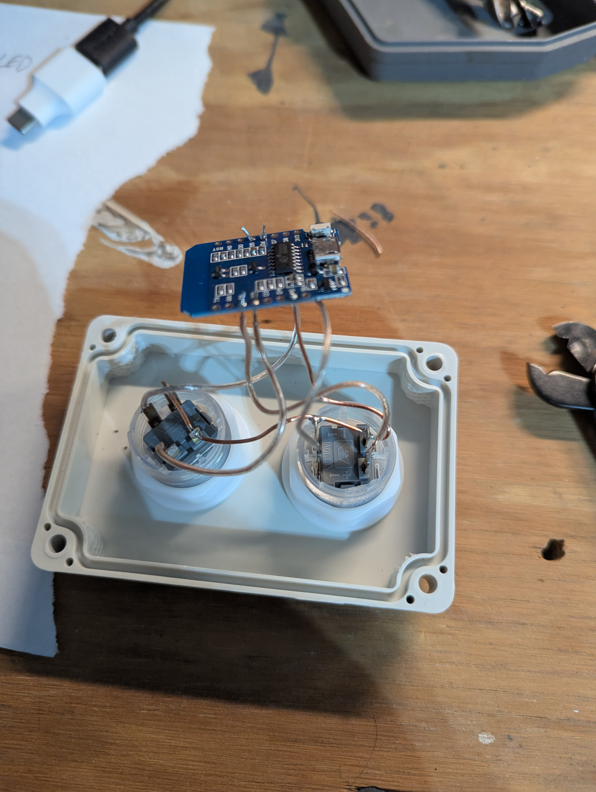
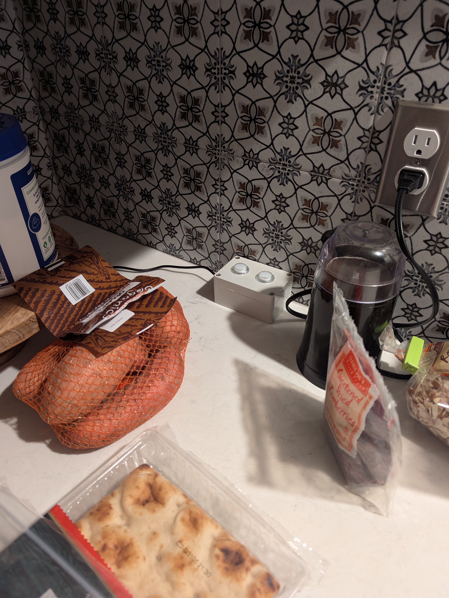

# Minder

A simple ESP8266-based device with two illuminated buttons (AM/PM) that light up at scheduled times to remind you to take your medication or feed your pet.

## Problem

"Did I take my pill this morning?" Or: "Did anyone feed Fido, or did three people feed Fido?"

Phone alarms don't work — you dismiss them and immediately forget. Worse, the reminder hits when you're in bed or on the couch, not in the kitchen where your pills actually are. You dismiss the notification, intending to take action — and the moment slips away.

Pill organizers help, but you still find yourself staring at the Tuesday slot wondering if today is Tuesday or if you already took it.

For pet feeding in multi-person households, it's even worse: "Did you feed the dog?" "I thought YOU fed the dog." Meanwhile the dog is acting starved regardless of the truth. And your phone doesn't know to remind you when you're standing by the dog bowl.

## Solution

**Right time, right place.**

A simple box with two glowing buttons that sits in your kitchen (or near where the pooch is fed):

- **AM button** lights up at your morning reminder time
- **PM button** lights up at your evening reminder time
- Press the button when you've done the thing — light goes off
- Forgot? The light is still on, staring at you

No app to open. No notification to dismiss. Just a physical, glanceable status that anyone in the household can see.

The device connects to WiFi to get the current time (NTP) and serves a simple web page for configuration — but day-to-day use requires zero interaction with your phone.

## Build Photos

### Raw Parts


### Making Holes


### Wire Up


### Deployed


## Features

- **AM button** lights up at configurable time (default 7:30 AM)
- **PM button** lights up at configurable time (default 8:00 PM)
- Press the button to acknowledge (turns off light)
- Light stays on until you press it (no more "did I take it?")
- Web interface to check status and configure times
- WiFiManager for easy WiFi setup
- Settings persist across reboots
- Automatic NTP time sync

## Hardware Required

| Part | Approx Cost | Notes |
|------|-------------|-------|
| Wemos D1 Mini (ESP8266) | $4-6 | Or any ESP8266 dev board |
| 2x 24mm LED Arcade Buttons | $5-8 | 5V illuminated, with microswitch |
| USB wall adapter | $2-4 | Any 5V USB power supply |
| Project enclosure | $5-10 | Plastic project box |
| Misc wire, solder | $0 | You probably have this |
| **Total** | **~$15-25** | |

## Wiring

```
Wemos D1 Mini:
  5V     ← USB power
  GND    ← USB ground
  D2     ← AM button switch (other side to GND)
  D1     ← PM button switch (other side to GND)
  D5     → AM button LED+ (LED- to GND)
  D6     → PM button LED+ (LED- to GND)
```

## Software Setup

### 1. Install Arduino IDE

Download from https://www.arduino.cc/en/software

### 2. Add ESP8266 Board Support

In Arduino IDE:
- Go to File → Preferences
- Add to "Additional Board Manager URLs": `http://arduino.esp8266.com/stable/package_esp8266com_index.json`
- Go to Tools → Board → Board Manager
- Search "ESP8266" and install

### 3. Install Required Libraries

In Arduino IDE, go to Sketch → Include Library → Manage Libraries:
- Search and install "WiFiManager" by tzapu

### 4. Upload the Code

- Open `next.ino` (the WiFiManager version) or `main.ino` (simpler version)
- Select Tools → Board → "LOLIN(WEMOS) D1 R2 & mini"
- Select your serial port
- Click Upload

## First Time Setup

1. Power on the device
2. Both LEDs will light up while it tries to connect
3. If no WiFi configured, it creates a network called "Minder-Setup"
4. Connect your phone to "Minder-Setup"
5. A captive portal opens — select your home WiFi and enter password
6. Device reboots and connects to your network

## Configuration

Once connected, open the device's IP address in a browser to:
- See current status (time, AM/PM reminder state)
- Set AM reminder time
- Set PM reminder time  
- Set timezone offset

## Re-entering Setup Mode

If you need to change WiFi networks:
- Hold both buttons for 5 seconds, OR
- Hold both buttons while plugging in power

The device will restart in setup mode.

## Troubleshooting

**LEDs don't light up:**
- Check wiring polarity (+ to GPIO, - to GND)
- The LEDs work fine at 3.3V from GPIO pins

**WiFi won't connect:**
- ESP8266 only supports 2.4GHz WiFi (not 5GHz)
- Double-check SSID and password

**Time is wrong:**
- Adjust timezone in web interface
- Note: No automatic DST handling

**Can't find device IP:**
- Check your router's connected devices list
- Or watch Serial Monitor during boot

## License

Do whatever you want with this. No warranty, no liability.
If it helps you remember your meds, that's great!
